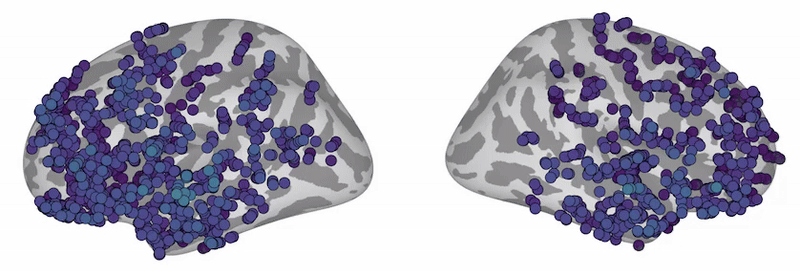

# Brain Foundation Models

<p align="center">
  <a href="https://neuroprobe.dev">
    
  </a>
</p>

<p align="center">
    <a href="https://www.python.org/">
        
    </a>
    <a href="https://pytorch.org/">
        
    </a>
</p>

<p align="center"><strong>Brain Foundation Models</strong></p>

## Onboarding

Please see the video at this link for onboarding (requires an MIT zoom log in):
[ONBOARDING VIDEO (20min)](https://mit.zoom.us/rec/share/s2XgwBipwcQDJEmb9OICnecNDenA0EyKidxDg_zP5M9GdvXQxbobaZVtM44AI3fe.4jEyRBNSP2bvQ_cU?startTime=1749952722000)

## Setup instructions

1. First, create a virtual environment and install the packages:
```sh
python -m venv .venv
source .venv/bin/activate
pip install --upgrade pip
pip install -r requirements.txt
```

2. If you're not on Openmind, follow the [Neuroprobe repository's](https://github.com/azaho/neuroprobe) instructions for how to download the BrainTreebank dataset and correct the path to the dataset in `evaluation/neuroprobe/config.py` and in `subject/braintreebank.py`. If you're on Openmind, you are all set!

3. Now you can try pretraining a model! Will require an A100 GPU (see the [openmind.mit.edu](https://openmind.mit.edu) instructions and FAQ for how to request a node with one)
```sh
python pretrain.py --training.setup_name andrii0 --cluster.cache_subjects 0 --cluster.eval_at_beginning 0
```
