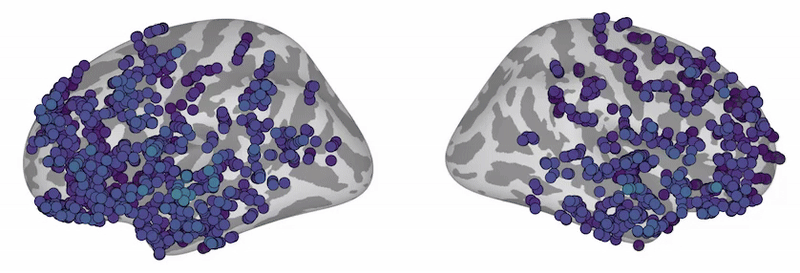

# Brain Foundation Models

<p align="center">
  <a href="https://neuroprobe.dev">
    
  </a>
</p>

<p align="center">
    <a href="https://www.python.org/">
        
    </a>
    <a href="https://pytorch.org/">
        
    </a>
</p>

## Onboarding

Please follow the instructions on [azaho.github.io/bfm/getting-started](https://azaho.github.io/bfm/getting-started/) for background knowledge, a brief overview of the repository, and the onboarding task.

## Installation

1. First, create a virtual environment and install the package:
```sh
python -m venv .venv
source .venv/bin/activate # On Windows: .venv/Scripts/activate
pip install --upgrade pip
pip install -e .[dev]
```

2. Copy over the contents of `.env.example` to `.env` and correct all variables like `DATASET_ROOT_DIR` to point to the root directories of the datasets on your machine. To start, you will only need the BrainTreebank dataset. If you need, follow the [Neuroprobe repository's](https://github.com/azaho/neuroprobe) instructions for how to download the BrainTreebank dataset and correct the `.env` variable `BRAIN_TREEBANK_ROOT_DIR` to point to the root directory of the BrainTreebank dataset on your machine. 

3. Now you can try pretraining a model! Will require an A100 GPU (see the [openmind.mit.edu](https://openmind.mit.edu) instructions and FAQ for how to request a node with one).
```sh
python -m bfm.pretrain --training.setup_name andrii0 --cluster.cache_subjects 0 --cluster.eval_at_beginning 0
```

P.S. For requesting an A100 node with enough RAM on Engaging, you might want to run
```sh
salloc -n 8 --mem=64G -p mit_preemptable --gres=gpu:a100:1
```

## License

This project is licensed under the MIT License - see the [LICENSE](LICENSE) file for details.
