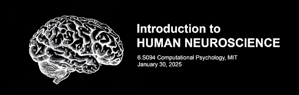
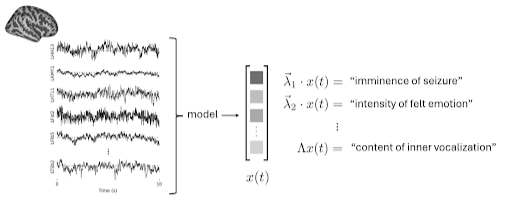
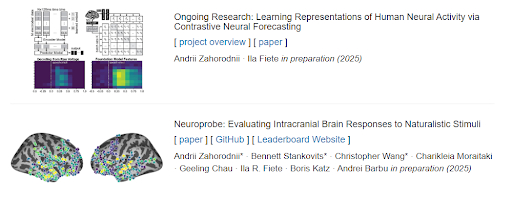

# Preliminary Background

The Brain Foundation Models (BFM) project is an initiative to develop and analyze large-scale models of brain function. The project aims to bridge the gap between neuroscience and machine learning by creating foundation models that can simulate and understand complex brain processes.

## Introduction to Human Neuroscience

!!! Slides
    For a comprehensive introduction to human neuroscience, please review these [slides](https://docs.google.com/presentation/d/1sAi4Ve-jf5c5d0HUJNJ0zBM-QifKDuI8/edit?usp=drive_link&ouid=113306152408669549596&rtpof=true&sd=true) (~2GB) from a talk I gave in the winter.

I will try to find a recording, or give it again! People told me after they loved this introductio. The most useful part for our purposes is the section on StereoEEG, and brain simulation experiments.

In parrticular, check out:

- Slide 4 (Optional): A doctor showing different parts of the brain (go to “Credit” for sound)
- Slide 14: Intracranial Electrophysiology neurotech (we will be working with it!)
- Slides 15-16: Stimulating the Fusiform Face Area for a Japanese patient; he describes how objects turn into faces in his mind when electrodes are stimulated
- Slide 17: Harry Forestell, a news reporter from Canada, describes how his Deep Brain Stimulation (DBS) treatment alleviates his tremor by stimulating electrodes
- Slide 24 (non-invasive, optional): Transcranial Magnetic Stimulation. A demo of how stimulating the brain with a high magnetic field can produce effects
- Slides 32-33: How stimulating the amygdala produces extreme feelings of fear
- Slides 35-36: Stimulating the hypothalamus modifying the emotional state
- Slides 37-38: Stimulating the Nucleus Accumbens (this guy would be in jail if he did this today probably – the ethics evolved significantly to where this would be unacceptable)
- Slides 45-46: Decoding images from visual regions in the brain (this is from 2011 though, the tech is SO much better now)

## Representation of Brain States

Given a ton of unlabeled neural data, we can create (learn) a transformation function from raw SEEG measurements into a latent feature vector x(t). Then, x(t) will be called a representation of the brain state over time. The goal is for x(t) to live in a latent space where features of interest are readily (linearly) available for decoding. For example, the physiological state of the person, stimuli that they are experiencing or processing, cognitive processes, aspects of their subjective experience, inner vocalization, etc.

!!! Slides
    Make sure to review the slides (Project Overview) from my Brain Foundation Models talk; this may be **the most important thing from the background**. I may do the talk again sometime in the future!

## Prior Work

!!! Papers
    Briefly skim the below two papers on my [personal website](https://azaho.org/). 

    - [Learning Representations of Human Neural Activity via Contrastive Neural Forecasting](https://azaho.org/papers/NeurIPS_2025__Contrastive_Neural_Forecasting_paper.pdf)
    - [Neuroprobe: Evaluating Intracranial Brain Responses to Naturalistic Stimuli](https://azaho.org/papers/NeurIPS_2025__BTBench_paper.pdf)

Also check out this [paper](https://glchau.github.io/population-transformer/) by my collaborators Chris and Geeling (optional). Don't spend too much time on the optional paper.

